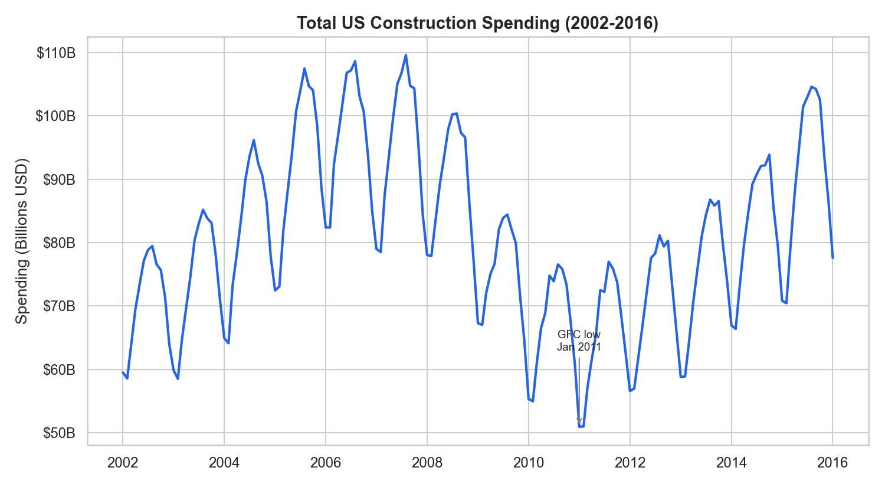
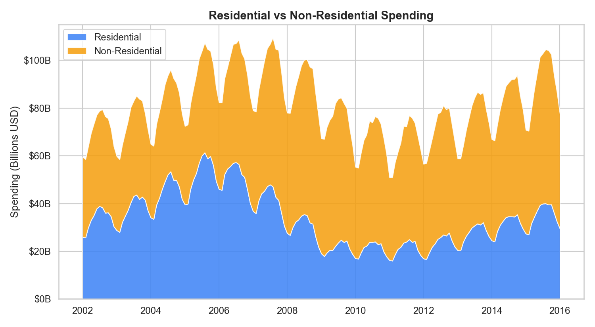
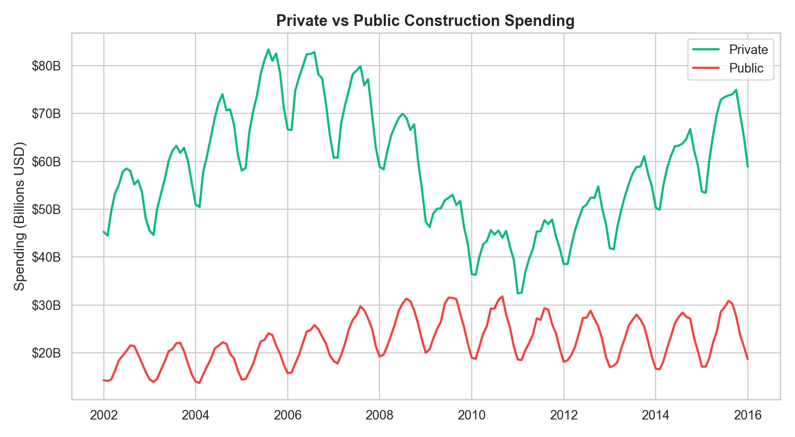
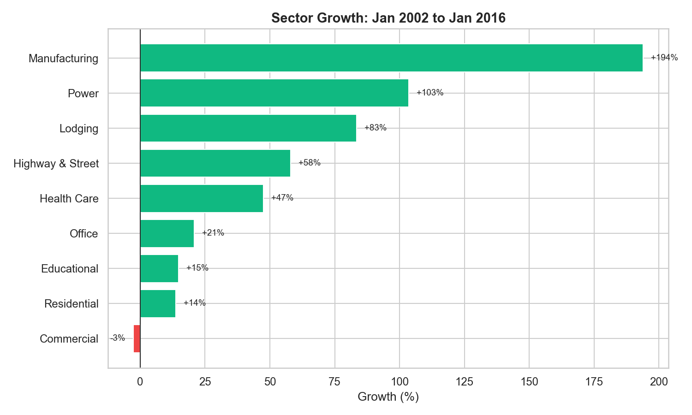
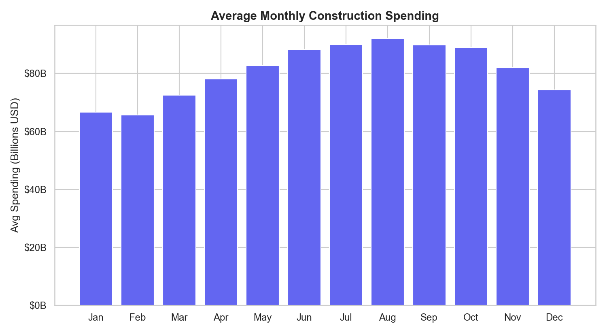
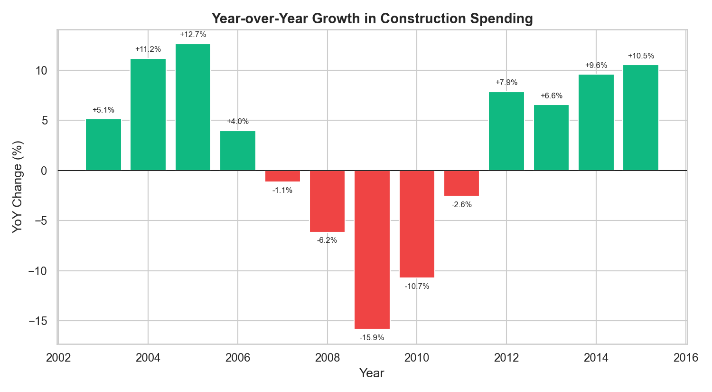

<p align="center">
  
  
  
  
  
</p>

# US Construction Spending Analysis (2002-2016)
> **[View Interactive Report](https://htmlpreview.github.io/?https://raw.githubusercontent.com/Tommy-Nguyen-Stonera/python-construction-spending-analysis/main/report.html)** — Full analysis with findings, methodology, and insights


An exploratory data analysis of 14 years of monthly US construction spending data from the Census Bureau. The dataset covers January 2002 through January 2016 — a period that captures the pre-GFC boom, the crash itself, and the long recovery — broken down by sector (residential, commercial, manufacturing, etc.) and funding type (private vs public).

## The Story Behind This Analysis

In building materials sales, we feel construction spending cycles directly. When residential spending drops, our tile and flooring orders drop with it. When a new hospital or university building gets funded, our commercial team sees the RFQs come through months later. I have always been curious about the numbers behind those gut feelings — how deep the GFC really cut, which sectors bounced back first, and whether the seasonal patterns we see in our order books match what the national data says.

I wanted to quantify these patterns rather than just rely on the anecdotal signals we get from the sales floor. This analysis is the result: a structured look at where construction dollars actually went over a 14-year stretch, and what that means for anyone selling into the building industry.

The thinking was straightforward. Start with the big picture — total spending over time — then break it apart. Once I saw how dramatic the GFC decline was, the natural follow-up was to ask *which sectors bore the brunt*. That led to the residential vs non-residential split, which led to the private vs public comparison (since stimulus spending was a major policy response). From there, I wanted to zoom into individual sectors to see where the real growth stories were hiding. Finally, the seasonal and year-over-year views round out the picture for anyone trying to time their sales activity.

## Business Questions

1. How has total construction spending trended over the past 14 years?
2. Which sectors grew the fastest, and which stalled or declined?
3. How did the GFC reshape spending between residential and non-residential construction?
4. Is there a seasonal pattern that building materials sales teams should plan around?
5. How does private vs public spending behave differently through economic cycles?
6. What does the year-over-year growth trajectory tell us about recovery momentum?

## Key Findings

### Total spending grew ~30%, but the path was anything but smooth

On paper, construction spending increased around 30% between 2002 and 2016. But that number hides a brutal downturn in the middle. The GFC caused spending to fall nearly 16% in 2009 alone, and the trough didn't arrive until 2011. For anyone in the industry during that period, those numbers match the reality — projects dried up, suppliers cut headcount, and the pipeline went quiet for years. The recovery that followed was genuine but slow, and by January 2016, total spending had only just surpassed its pre-crisis peak. That "30% growth" took 14 years and included a catastrophic collapse in the middle.

### Residential was the epicentre of the crash

Residential spending dropped roughly 60% from its 2006 peak to its 2011 trough. Non-residential construction held up much better, continuing to grow for a couple of years after residential had already started falling. This lag effect matters for building materials suppliers: it means non-residential demand can temporarily mask a downturn that is already underway in the residential market. If you are only watching your commercial order book, you might miss the warning signs.

This made me revisit the total spending chart with fresh eyes. The total line looked like it peaked in 2006, but when I separated the components, I realised residential had already been declining for a year before total spending peaked. The total figure was being propped up by non-residential. If you were watching only the headline number in 2007, you would have missed the warning.

### Public spending acted as a shock absorber

When private construction spending cratered during the GFC, public spending — highways, schools, water infrastructure — stayed relatively flat or even increased, buoyed by federal stimulus programs. Private spending accounts for roughly 75% of total construction, so it drives the overall trend. But public spending is dramatically more stable, which makes government contracts a valuable stabilising force for any building materials business trying to smooth out revenue through a downturn.

### Manufacturing and power led the growth story

The sector-level breakdown revealed some striking divergences. Manufacturing construction grew 194% over the period, and power infrastructure grew 103%. These are not the sectors most people think of when they hear "construction boom" — but they reflect massive capital investment in industrial capacity and energy infrastructure. Meanwhile, commercial construction was the only sector to *decline* (-3%), which likely reflects the early stages of the retail real estate contraction that has since accelerated.

Manufacturing construction grew 194% — the largest growth of any sector. I expected commercial to be somewhere near the top too, given the number of new shopping centres and office buildings I had seen going up. But commercial was the only sector to decline (-3%). That forced me to ask: was this an early signal of the retail real estate contraction? In hindsight, with the e-commerce shift accelerating from 2010 onward, the data was showing a structural change that most of us in the industry did not recognise at the time.

### Seasonal patterns are consistent and actionable

Spending peaks reliably between June and August and dips in January and February. The pattern holds across years, which makes it genuinely useful for planning. For a building materials business, this means Q1 is the time to build pipeline — the orders placed in March and April are the ones that deliver into the peak construction months. Anyone staffing up or stocking inventory for mid-year demand should be planning in the winter.

This seasonal pattern holds at the total spending level, but I suspect residential and non-residential have different seasonal profiles. If residential peaks in summer (outdoor work, suburban builds) while commercial is steadier year-round, then the seasonal planning advice for a supplier depends entirely on their customer mix.

### Year-over-year growth tells the recovery story

The YoY growth chart makes the recovery dynamics clear. After the sharp contraction of 2008-2010, growth turned positive in 2012 and stayed positive through 2015. But the growth rate was modest — mostly in the 4-8% range — not the kind of V-shaped recovery you might expect after such a deep decline. This gradual recovery is consistent with tight lending conditions and cautious sentiment in the construction industry post-GFC.

## What Surprised Me

The commercial construction decline was the most unexpected finding. Between 2002 and 2016, every other sector managed at least moderate growth — even through the GFC. Commercial was the sole decliner. In hindsight, this makes sense: the period coincides with the early stages of the e-commerce shift that hollowed out traditional retail. But I did not expect it to show up so clearly in a 14-year spending comparison. It is a reminder that some structural shifts start quietly and only become obvious in retrospect.

The other surprise was how long the recovery took. Residential spending did not return to its pre-GFC level within the dataset period (ending January 2016). That is nearly a decade of below-peak spending — a lost decade for residential construction, essentially. Anyone who assumed a quick bounce-back would have been wrong for years.

## What I'd Investigate Next

- **Regional breakdown**: National data smooths over significant geographic variation. The Sun Belt and Midwest likely had very different recovery curves. For a sales team covering specific territories, regional data would be far more actionable.
- **Leading indicators**: Can permits data or architectural billings predict the spending trends we see here with a 6-12 month lead? If so, building a simple forecasting model could give a sales team genuine advance warning.
- **Material cost correlation**: When spending rises, do material costs rise with it (demand-pull inflation), or do they move independently? Understanding that relationship would help with pricing strategy.
- **Post-2016 trends**: This dataset ends in January 2016. Extending it through 2024 would capture the post-COVID construction boom and the impact of infrastructure legislation — a completely different environment from the GFC recovery period.
- **Seasonality by sector**: The seasonal analysis here is on total spending. Residential and commercial might have different seasonal profiles, which would matter for a supplier with exposure to both.

## Visualisations

### 1. Total Construction Spending Trend (2002-2016)



**What this shows:** Monthly total US construction spending from January 2002 to January 2016, with the GFC trough annotated. The line traces the full boom-bust-recovery cycle.

**Why it matters:** This is the macro view that frames everything else. It shows that while the headline number grew over the period, the path included a severe multi-year contraction. For anyone in building materials, this chart is a reminder that "long-term growth" can include extended periods of painful decline.

---

### 2. Residential vs Non-Residential Spending



**What this shows:** A stacked area chart splitting total spending into residential and non-residential components. The residential collapse during the GFC is visually stark — it dominates the overall spending decline.

**Why it matters:** Non-residential spending proved far more resilient during the downturn. For a building materials business, this suggests that diversifying across residential and commercial customers is not just a growth strategy — it is a risk management strategy. A supplier heavily concentrated in residential would have experienced a much sharper revenue decline than one with a balanced book.

---

### 3. Private vs Public Spending



**What this shows:** Two overlaid trend lines comparing privately-funded construction with publicly-funded construction. Private spending is larger but more volatile; public spending is smaller but remarkably steady.

**Why it matters:** The stability of public spending makes government-funded projects a valuable anchor for building materials suppliers during economic downturns. The chart shows public spending actually increasing during the worst of the GFC — a direct result of stimulus policy. Suppliers with relationships in the public sector had a floor under their revenue when the private market collapsed.

---

### 4. Sector Growth Comparison (2002-2016)



**What this shows:** A horizontal bar chart ranking nine construction sectors by their total percentage growth from January 2002 to January 2016. Manufacturing leads at +194%, while commercial is the only sector in negative territory.

**Why it matters:** This chart identifies where the structural growth has been. Manufacturing and power infrastructure represent long-term capital investment trends that are likely to continue. The commercial decline is an early warning of the structural shift in retail real estate. For sales prioritisation, sectors at the top of this chart represent the highest-growth opportunities.

---

### 5. Seasonal Spending Pattern



**What this shows:** Average monthly construction spending across all years in the dataset, plotted as a bar chart. The pattern shows a clear mid-year peak and winter trough.

**Why it matters:** The consistency of this seasonal pattern makes it directly actionable. Building materials suppliers should expect their highest order volumes in Q2-Q3 and should use Q1 to build pipeline, staff up, and stock inventory. Marketing campaigns and sales pushes timed for March-April will align with the natural ramp-up in construction activity.

---

### 6. Year-over-Year Growth Rate



**What this shows:** Annual year-over-year change in average construction spending from 2003 to 2015. Red bars indicate contraction years; green bars indicate growth.

**Why it matters:** This chart reveals the speed of the decline and the gradualness of the recovery. The contraction was sharp (peaking at -15.7% in 2009), but the recovery was methodical — consistent 4-8% growth from 2012 onward. For forecasting purposes, this suggests that post-downturn recoveries in construction tend to be slow and steady rather than sudden, which has implications for hiring, inventory, and capital expenditure decisions.

## How to Run

```bash
pip install pandas matplotlib seaborn
python analysis.py
```

Outputs are saved to the `visuals/` folder.

## Tools Used

- **Python 3.12** — data processing, cleaning, and analysis
- **Pandas** — data loading, datetime parsing, grouping, and aggregation
- **Matplotlib** — chart rendering, annotation, and formatting
- **Seaborn** — theme styling and colour palettes

## AI Tools Disclosure

I used AI coding assistants for debugging and code suggestions. The analysis approach, business questions, and all interpretations are my own work.

## Data Source

[US Census Bureau](https://www.census.gov/construction/c30/c30index.html) — Value of Construction Put in Place Survey (monthly, not seasonally adjusted)

## Data Methodology Note

The dataset from the Census Bureau reports spending in seasonally adjusted annual rates, not raw monthly figures. I initially missed this distinction and was comparing figures as if they were actual monthly spend. Once I realised the adjustment, the seasonal analysis made more sense — the near-flat monthly pattern is partly by design, since seasonal adjustment removes the very signal I was looking for. To see true seasonality, you would need the unadjusted series.

---

**Tommy Nguyen** | [GitHub](https://github.com/Tommy-Nguyen-Stonera) · [Portfolio](https://tommy-nguyen-stonera.vercel.app)
